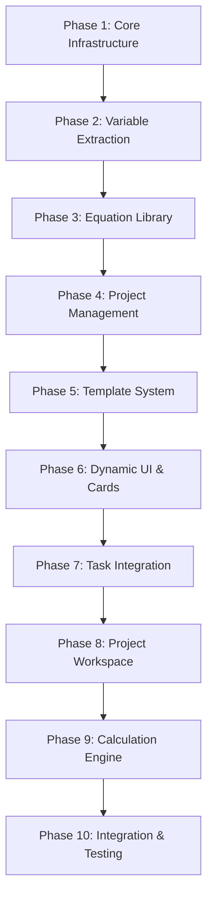

# MathML Parser Implementation Phases - Detailed Strategy

## Executive Summary

This document provides a comprehensive breakdown of the 10-phase implementation strategy for the MathML equation parser AI agent. Each phase is designed to build upon the previous one while maintaining system integrity and enabling seamless integration. The strategy emphasizes incremental delivery, risk mitigation, and continuous validation to ensure project success.

## Phase Overview and Dependencies

## Phase 1: Core Infrastructure & Setup
**Duration**: 2 weeks  
**Team Size**: 2 developers  
**Priority**: Critical Foundation

### 1.1 Objectives
- Establish robust development environment with all dependencies pre-installed
- Create foundational data architecture
- Implement basic MathML parsing capabilities
- Set up Entity Framework with SQLite database

### 1.2 Critical Success Factors

#### 1.2.1 Development Environment
- **Container Stability**: Dev container must run without errors on all team machines
- **Dependency Management**: All NuGet packages pre-installed and version-locked
- **Build System**: Automated build and test pipeline functional
- **Database Setup**: SQLite database with proper connection pooling

#### 1.2.2 Data Architecture Foundation
- **Entity Framework**: Clean, maintainable data model with proper relationships
- **Migration Strategy**: Automated migrations with rollback capabilities
- **Connection Management**: Proper connection string configuration
- **Seed Data**: Initial data for testing and development

#### 1.2.3 Basic MathML Parsing
- **XML Parsing**: Robust XML document handling with error recovery
- **Namespace Support**: Proper MathML namespace handling
- **Basic Validation**: Schema validation for MathML structure
- **Error Handling**: Comprehensive error capture and logging

### 1.3 Deliverables
- Functional dev container with all dependencies
- Core data models (ParsedEquation, Variable, Project, Task, TaskCard)
- ApplicationDbContext with initial migration
- Basic MathMLParserService with XML parsing
- Unit test framework setup
- Initial project structure following defined architecture

### 1.4 Integration Points for Phase 2
- **Parser Interface**: Clean abstraction for variable extraction
- **Data Model Extensibility**: Flexible Variable model for subscripts/superscripts
- **Validation Framework**: Extensible validation system
- **Error Handling**: Consistent error handling patterns

### 1.5 Risk Mitigation
- **Dependency Conflicts**: Version locking and container testing
- **Database Issues**: SQLite fallback and connection testing
- **Environment Inconsistency**: Standardized container configuration
- **Team Onboarding**: Comprehensive setup documentation

### 1.6 Quality Gates
- [ ] Dev container runs on all team machines
- [ ] All unit tests pass
- [ ] Database migrations work correctly
- [ ] Basic MathML parsing functional
- [ ] Code coverage > 80%

---

## Phase 2: Variable Extraction & Validation
**Duration**: 2 weeks  
**Team Size**: 2 developers  
**Priority**: Core Functionality

### 2.1 Objectives
- Implement comprehensive variable detection from MathML
- Handle complex mathematical notation (subscripts, superscripts, functions)
- Create robust validation system with engineering units
- Establish pattern for input form generation

### 2.2 Critical Success Factors

#### 2.2.1 Variable Detection Accuracy
- **Subscript Parsing**: Correctly identify variables like `f_y`, `d_w`, `t_w`
- **Superscript Handling**: Extract base variables from expressions like `t_w^2`
- **Function Recognition**: Identify function arguments (sin(x) → variable x)
- **Output Identification**: Accurately determine left-side variables

#### 2.2.2 Engineering Units Support
- **Unit System**: Comprehensive support for kN, mm, MPa, kNm
- **Dimensional Analysis**: Proper unit calculation and validation
- **Unit Conversion**: Seamless conversion between compatible units
- **Error Detection**: Invalid unit combination detection

#### 2.2.3 Validation Framework
- **Real-time Validation**: Immediate feedback on input changes
- **Field-level Errors**: Specific error messages for each input
- **Cross-field Validation**: Unit compatibility checking
- **Performance**: Validation responses under 100ms

### 2.3 Deliverables
- Enhanced MathMLParserService with variable extraction
- UnitSystem with engineering unit support
- ValidationService with real-time validation
- Variable model with subscript/superscript support
- Comprehensive test suite for variable detection
- Input form generation foundation

### 2.4 Integration Points for Phase 3
- **Equation Metadata**: Variable information for equation storage
- **Validation Rules**: Reusable validation for equation library
- **Unit Persistence**: Unit information storage in database
- **Error Handling**: Consistent error patterns

### 2.5 Risk Mitigation
- **Parsing Complexity**: Extensive test cases for edge cases
- **Performance Issues**: Caching and optimization strategies
- **Unit System Bugs**: Reference implementation testing
- **Validation Errors**: Comprehensive error message testing

### 2.6 Quality Gates
- [ ] All variable types correctly identified
- [ ] Engineering units properly supported
- [ ] Validation responds under 100ms
- [ ] 95% test coverage on parser
- [ ] No memory leaks in parsing process

---

## Phase 3: Equation Library System
**Duration**: 2 weeks  
**Team Size**: 2 developers  
**Priority**: Content Management

### 3.1 Objectives
- Create persistent equation storage system
- Implement categorization and search functionality
- Build equation management interface
- Establish import/export capabilities

### 3.2 Critical Success Factors

#### 3.2.1 Data Management
- **Equation Storage**: Efficient storage with metadata
- **Categorization**: Meaningful categories for structural engineering
- **Search Performance**: Fast search across equation names and descriptions
- **Version Control**: Ability to update equations without data loss

#### 3.2.2 User Interface
- **Equation Browser**: Intuitive browsing with preview capabilities
- **Search Functionality**: Real-time search with filtering
- **Equation Editor**: Add/edit equations with validation
- **Preview System**: Live MathML rendering

#### 3.2.3 Integration Architecture
- **Service Layer**: Clean separation between UI and data
- **API Design**: RESTful endpoints for equation management
- **Caching Strategy**: Efficient caching for frequently accessed equations
- **Error Handling**: Graceful handling of database errors

### 3.3 Deliverables
- EquationLibraryService with full CRUD operations
- Equation storage database schema
- EquationLibrary Blazor component
- Search and filtering functionality
- Import/export capabilities
- Equation categorization system

### 3.4 Integration Points for Phase 4
- **Project Integration**: Equation selection for project tasks
- **Template System**: Equation references in templates
- **Metadata Consistency**: Consistent equation metadata
- **Performance Optimization**: Efficient equation loading

### 3.5 Risk Mitigation
- **Database Performance**: Proper indexing and query optimization
- **Search Complexity**: Efficient search algorithms
- **Data Integrity**: Referential integrity with projects
- **User Experience**: Intuitive interface design

### 3.6 Quality Gates
- [ ] Equation CRUD operations functional
- [ ] Search performs under 200ms
- [ ] All equation categories supported
- [ ] Import/export working correctly
- [ ] UI responsive and intuitive

---

## Phase 4: Project Management Foundation
**Duration**: 3 weeks  
**Team Size**: 3 developers  
**Priority**: Core Architecture

### 4.1 Objectives
- Implement hierarchical project structure
- Create project persistence with data integrity
- Build project dashboard and workspace foundation
- Establish task management system

### 4.2 Critical Success Factors

#### 4.2.1 Data Architecture
- **Hierarchical Integrity**: Proper parent-child relationships
- **Cascade Operations**: Correct deletion and update cascading
- **Transaction Management**: ACID compliance for complex operations
- **Data Serialization**: Efficient JSON serialization for input data

#### 4.2.2 Project Management
- **Project Lifecycle**: Create, save, load, delete operations
- **Concurrency Control**: Multi-user project access handling
- **Version Control**: Basic versioning for project changes
- **Backup Strategy**: Project data backup and recovery

#### 4.2.3 User Experience
- **Project Dashboard**: Clear project overview and navigation
- **Quick Actions**: Efficient project management operations
- **Loading States**: Smooth loading experiences
- **Error Recovery**: Graceful error handling and recovery

### 4.3 Deliverables
- ProjectService with complete project lifecycle
- Project data model with relationships
- ProjectDashboard Blazor component
- Task management foundation
- Project persistence layer
- Basic project workspace structure

### 4.4 Integration Points for Phase 5
- **Template Integration**: Project template creation and application
- **Task Templates**: Foundation for task template system
- **Metadata Consistency**: Consistent project metadata
- **Performance Baseline**: Performance benchmarks for templates

### 4.5 Risk Mitigation
- **Data Complexity**: Comprehensive relationship testing
- **Performance Issues**: Efficient data loading strategies
- **Concurrency Problems**: Proper locking mechanisms
- **Data Loss**: Robust backup and recovery procedures

### 4.6 Quality Gates
- [ ] Project CRUD operations functional
- [ ] Data integrity maintained
- [ ] Dashboard responsive and functional
- [ ] Save/load operations under 2 seconds
- [ ] All relationship constraints working

---

## Phase 5: Template System
**Duration**: 2 weeks  
**Team Size**: 2 developers  
**Priority**: Reusability

### 5.1 Objectives
- Implement task template creation and storage
- Build template library with browsing capabilities
- Create template application workflow
- Establish template sharing and export

### 5.2 Critical Success Factors

#### 5.2.1 Template Architecture
- **Data Separation**: Clear separation between template and instance data
- **Reusability**: Templates work across different projects
- **Versioning**: Template version control and updates
- **Metadata Management**: Rich template metadata and categorization

#### 5.2.2 Template Library
- **Organization**: Logical template organization and categorization
- **Search and Filter**: Efficient template discovery
- **Preview System**: Template preview before application
- **User Experience**: Intuitive template browsing

#### 5.2.3 Application Workflow
- **Template Selection**: Easy template selection and preview
- **Customization**: Template customization during application
- **Validation**: Template validation before application
- **Performance**: Fast template application process

### 5.3 Deliverables
- TemplateService with template lifecycle management
- Template data model and storage
- TemplateLibrary Blazor component
- Template application workflow
- Template export/import functionality
- Template browsing and search

### 5.4 Integration Points for Phase 6
- **UI Integration**: Template selection in card creation
- **Dynamic Forms**: Template-driven form generation
- **Validation Integration**: Template validation in UI
- **Performance Optimization**: Efficient template loading

### 5.5 Risk Mitigation
- **Template Complexity**: Thorough template testing
- **Data Consistency**: Template and instance data validation
- **Performance Issues**: Template caching strategies
- **User Confusion**: Clear template application workflow

### 5.6 Quality Gates
- [ ] Template CRUD operations functional
- [ ] Template application working correctly
- [ ] Template library intuitive and responsive
- [ ] Export/import functionality working
- [ ] Template validation comprehensive

---

## Phase 6: Dynamic UI & Card System
**Duration**: 3 weeks  
**Team Size**: 3 developers  
**Priority**: User Experience

### 6.1 Objectives
- Create compact calculation cards with capacity focus
- Implement TeMML rendering for equations
- Build responsive card layouts with interactions
- Establish real-time validation with error messaging

### 6.2 Critical Success Factors

#### 6.2.1 Card Design
- **Compact Layout**: Efficient use of screen space
- **Responsive Design**: Works on desktop, tablet, and mobile
- **Visual Hierarchy**: Clear information hierarchy
- **Interactive Elements**: Smooth hover and click interactions

#### 6.2.2 TeMML Integration
- **Rendering Performance**: Fast equation rendering
- **Mathematical Accuracy**: Correct mathematical display
- **Browser Compatibility**: Consistent rendering across browsers
- **Error Handling**: Graceful rendering error handling

#### 6.2.3 Real-time Validation
- **Immediate Feedback**: Instant validation responses
- **Field-level Errors**: Specific error messages for each field
- **Visual Indicators**: Clear visual feedback for validation state
- **Performance**: Validation under 100ms

### 6.3 Deliverables
- CalculationCard Blazor component
- TeMML integration and rendering service
- Dynamic form generation system
- Real-time validation framework
- Responsive card layout system
- Error messaging and feedback system

### 6.4 Integration Points for Phase 7
- **Task Integration**: Cards within task containers
- **Card Management**: Add, remove, reorder cards
- **Data Binding**: Card data binding to task data
- **Event Handling**: Card events and task coordination

### 6.5 Risk Mitigation
- **Rendering Issues**: Extensive browser testing
- **Performance Problems**: Optimization and caching
- **Mobile Compatibility**: Responsive design testing
- **User Experience**: Usability testing and feedback

### 6.6 Quality Gates
- [ ] Cards render correctly on all devices
- [ ] TeMML rendering functional
- [ ] Real-time validation working
- [ ] Card interactions smooth
- [ ] Error messaging clear and helpful

---

## Phase 7: Task Integration
**Duration**: 2 weeks  
**Team Size**: 2 developers  
**Priority**: Workflow Integration

### 7.1 Objectives
- Implement task containers with card management
- Create task-level calculations and summaries
- Build task template application
- Establish task duplication and management

### 7.2 Critical Success Factors

#### 7.2.1 Task Container Design
- **Card Management**: Add, remove, reorder cards within tasks
- **Visual Organization**: Clear task boundaries and organization
- **Drag and Drop**: Smooth card reordering experience
- **Responsive Layout**: Task containers work on all devices

#### 7.2.2 Task-level Operations
- **Calculation Summary**: Aggregate calculations across cards
- **Template Application**: Apply templates to create task structure
- **Task Duplication**: Duplicate tasks with or without data
- **Validation**: Task-level validation and error handling

#### 7.2.3 Data Management
- **Card Data**: Proper card data management within tasks
- **Task State**: Consistent task state management
- **Performance**: Efficient task operations
- **Data Integrity**: Maintain data consistency across operations

### 7.3 Deliverables
- TaskContainer Blazor component
- Task-level calculation system
- Template application for tasks
- Task duplication functionality
- Card management within tasks
- Task validation and error handling

### 7.4 Integration Points for Phase 8
- **Project Integration**: Tasks within project workspace
- **Project-level Operations**: Task operations in project context
- **Data Consistency**: Task data consistency in projects
- **Performance Optimization**: Efficient task loading in projects

### 7.5 Risk Mitigation
- **Complexity Management**: Clear task-card relationship
- **Performance Issues**: Efficient task rendering
- **Data Consistency**: Proper task data management
- **User Experience**: Intuitive task operations

### 7.6 Quality Gates
- [ ] Task containers functional
- [ ] Card management working
- [ ] Template application successful
- [ ] Task operations smooth
- [ ] Data consistency maintained

---

## Phase 8: Project Workspace
**Duration**: 2 weeks  
**Team Size**: 2 developers  
**Priority**: Complete Workflow

### 8.1 Objectives
- Complete project editor with full functionality
- Implement project-level calculations and reporting
- Build project templates and duplication
- Establish comprehensive save/load with data persistence

### 8.2 Critical Success Factors

#### 8.2.1 Project Editor
- **Complete Functionality**: All project operations functional
- **User Experience**: Intuitive project editing workflow
- **Performance**: Responsive project operations
- **Data Management**: Proper project data handling

#### 8.2.2 Project Operations
- **Save/Load**: Comprehensive project persistence
- **Duplication**: Project duplication with options
- **Templates**: Project template creation and application
- **Reporting**: Project-level calculation summaries

#### 8.2.3 Data Integrity
- **Consistency**: Data consistency across all operations
- **Validation**: Project-level validation
- **Recovery**: Error recovery and data protection
- **Performance**: Efficient project operations

### 8.3 Deliverables
- Complete ProjectWorkspace component
- Project-level calculation system
- Project templates and duplication
- Comprehensive save/load functionality
- Project reporting and summaries
- Project validation and error handling

### 8.4 Integration Points for Phase 9
- **Calculation Integration**: Project calculations using engine
- **Performance Optimization**: Efficient calculation handling
- **Error Handling**: Comprehensive error management
- **Data Validation**: Calculation input validation

### 8.5 Risk Mitigation
- **System Complexity**: Comprehensive integration testing
- **Performance Issues**: Load testing and optimization
- **Data Integrity**: Extensive data validation
- **User Experience**: Usability testing and refinement

### 8.6 Quality Gates
- [ ] Project editor fully functional
- [ ] Save/load operations working
- [ ] Project templates functional
- [ ] Reporting system working
- [ ] All project operations smooth

---

## Phase 9: Calculation Engine & Units
**Duration**: 2 weeks  
**Team Size**: 2 developers  
**Priority**: Core Functionality

### 9.1 Objectives
- Implement mathematical expression evaluator
- Add comprehensive engineering unit system
- Build dimensional analysis capabilities
- Optimize performance for multiple calculations

### 9.2 Critical Success Factors

#### 9.2.1 Calculation Engine
- **Mathematical Accuracy**: Precise calculation results
- **Function Support**: Comprehensive mathematical functions
- **Error Handling**: Robust error detection and recovery
- **Performance**: Calculations under 1 second

#### 9.2.2 Unit System
- **Engineering Units**: Complete kN, mm, MPa, kNm support
- **Dimensional Analysis**: Automatic unit calculation
- **Unit Validation**: Proper unit compatibility checking
- **Conversion**: Seamless unit conversion

#### 9.2.3 Performance Optimization
- **Parallel Processing**: Multiple calculation handling
- **Caching**: Calculation result caching
- **Memory Management**: Efficient memory usage
- **Scalability**: Support for concurrent calculations

### 9.3 Deliverables
- CalculationService with full functionality
- Engineering unit system with dimensional analysis
- Mathematical expression evaluator
- Performance optimization
- Comprehensive error handling
- Calculation result caching

### 9.4 Integration Points for Phase 10
- **System Integration**: Calculation engine in complete system
- **Performance Testing**: Load testing with calculations
- **Error Integration**: Error handling across system
- **Data Validation**: Calculation data validation

### 9.5 Risk Mitigation
- **Calculation Errors**: Extensive mathematical testing
- **Performance Issues**: Performance testing and optimization
- **Unit System Bugs**: Comprehensive unit testing
- **Memory Issues**: Memory profiling and optimization

### 9.6 Quality Gates
- [ ] Calculation engine functional
- [ ] Unit system working correctly
- [ ] Performance targets met
- [ ] Error handling comprehensive
- [ ] Multiple calculations supported

---

## Phase 10: Integration & Testing
**Duration**: 3 weeks  
**Team Size**: 4 developers  
**Priority**: Quality Assurance

### 10.1 Objectives
- Complete end-to-end integration testing
- Conduct comprehensive user acceptance testing
- Perform load testing and optimization
- Finalize documentation and deployment

### 10.2 Critical Success Factors

#### 10.2.1 Integration Testing
- **End-to-end Workflows**: Complete workflow testing
- **Cross-component Integration**: All components working together
- **Data Flow**: Proper data flow across system
- **Error Handling**: Comprehensive error handling testing

#### 10.2.2 Performance Testing
- **Load Testing**: 50+ concurrent users
- **Stress Testing**: System limits and recovery
- **Memory Testing**: Memory usage and leak detection
- **Response Time**: All performance targets met

#### 10.2.3 User Acceptance Testing
- **Structural Engineering Scenarios**: Real-world testing
- **Usability Testing**: User interface and experience
- **Accessibility Testing**: WCAG compliance
- **Browser Testing**: Cross-browser compatibility

### 10.3 Deliverables
- Complete integration test suite
- Performance test results and optimizations
- User acceptance test completion
- Comprehensive documentation
- Deployment preparation
- Final quality assurance report

### 10.4 Success Criteria
- All acceptance criteria met
- Performance benchmarks achieved
- User satisfaction targets met
- System ready for production deployment
- Documentation complete and accurate

### 10.5 Risk Mitigation
- **Integration Issues**: Comprehensive testing protocols
- **Performance Problems**: Load testing and optimization
- **User Feedback**: Iterative improvement process
- **Deployment Risks**: Thorough deployment testing

### 10.6 Quality Gates
- [ ] All integration tests passing
- [ ] Performance targets achieved
- [ ] User acceptance criteria met
- [ ] Documentation complete
- [ ] System ready for deployment

---

## Cross-Phase Integration Strategy

### Integration Architecture

#### Data Flow Consistency
- **Standardized Models**: Consistent data models across all phases
- **Service Contracts**: Well-defined service interfaces
- **Error Handling**: Consistent error handling patterns
- **Validation**: Unified validation framework

#### Performance Optimization
- **Incremental Loading**: Efficient data loading strategies
- **Caching Strategy**: Multi-level caching implementation
- **Memory Management**: Proper resource cleanup
- **Database Optimization**: Query optimization and indexing

#### User Experience Continuity
- **Design System**: Consistent UI components and patterns
- **Interaction Patterns**: Standardized user interactions
- **Error Messages**: Consistent error messaging
- **Loading States**: Uniform loading indicators

### Phase Transition Protocols

#### Phase Completion Criteria
1. **Functional Requirements**: All phase objectives met
2. **Quality Gates**: All quality gates passed
3. **Integration Points**: Next phase integration prepared
4. **Documentation**: Phase documentation complete
5. **Testing**: Comprehensive testing completed

#### Phase Handoff Process
1. **Code Review**: Comprehensive code review
2. **Documentation Transfer**: Complete documentation handoff
3. **Knowledge Transfer**: Team knowledge sharing
4. **Testing Results**: Test results and metrics
5. **Risk Assessment**: Risk evaluation and mitigation

### Continuous Integration Strategy

#### Development Practices
- **Daily Builds**: Automated daily builds and tests
- **Code Reviews**: Mandatory peer reviews
- **Unit Testing**: Comprehensive unit test coverage
- **Integration Testing**: Continuous integration testing
- **Performance Monitoring**: Regular performance checks

#### Quality Assurance
- **Automated Testing**: Comprehensive test automation
- **Code Coverage**: 90%+ code coverage maintained
- **Performance Benchmarks**: Regular performance testing
- **Security Scanning**: Automated security checks
- **Documentation Updates**: Continuous documentation updates

## Risk Management Across Phases

### Technical Risks

#### High-Impact Risks
1. **MathML Parsing Complexity**: Extensive test cases and fallback strategies
2. **Performance Degradation**: Continuous performance monitoring
3. **Data Integrity Issues**: Comprehensive validation and testing
4. **Integration Failures**: Thorough integration testing protocols

#### Medium-Impact Risks
1. **Browser Compatibility**: Cross-browser testing strategy
2. **User Experience Issues**: Regular usability testing
3. **Scaling Problems**: Load testing and optimization
4. **Third-party Dependencies**: Dependency management and alternatives

### Project Risks

#### Schedule Risks
- **Phase Delays**: Buffer time and resource flexibility
- **Resource Availability**: Cross-training and documentation
- **Scope Creep**: Clear change management process
- **Technical Complexity**: Phased approach and MVP focus

#### Quality Risks
- **Inadequate Testing**: Comprehensive testing strategy
- **Performance Issues**: Regular performance monitoring
- **Security Vulnerabilities**: Security testing and reviews
- **User Satisfaction**: Regular user feedback and iteration

## Success Metrics and Monitoring

### Phase-Level Metrics

#### Technical Metrics
- **Code Quality**: Code coverage, complexity, maintainability
- **Performance**: Response time, throughput, resource usage
- **Reliability**: Error rate, uptime, recovery time
- **Security**: Vulnerability count, security test results

#### User Experience Metrics
- **Usability**: Task completion rate, error rate, satisfaction
- **Performance**: Page load time, interaction response time
- **Accessibility**: WCAG compliance, screen reader compatibility
- **Mobile Experience**: Mobile usability and performance

#### Business Metrics
- **Delivery**: On-time delivery, scope completion
- **Quality**: Defect rate, customer satisfaction
- **Efficiency**: Development velocity, resource utilization
- **Value**: Feature adoption, user engagement

### Continuous Monitoring

#### Automated Monitoring
- **Build Success Rate**: Continuous integration success
- **Test Coverage**: Automated test coverage monitoring
- **Performance Metrics**: Automated performance testing
- **Security Scanning**: Automated security vulnerability scanning

#### Manual Monitoring
- **Code Reviews**: Regular code review metrics
- **User Feedback**: Regular user feedback collection
- **Performance Reviews**: Regular performance assessments
- **Quality Audits**: Regular quality assurance reviews

## Conclusion

This comprehensive implementation strategy provides a structured approach to delivering the MathML equation parser AI agent. The phased approach ensures:

### Key Success Factors
- **Incremental Delivery**: Each phase builds on previous work
- **Risk Mitigation**: Comprehensive risk management throughout
- **Quality Assurance**: Continuous testing and validation
- **User Focus**: Regular user feedback and iteration
- **Technical Excellence**: High standards for code quality and performance

### Critical Dependencies
- **Team Expertise**: Skilled development team with domain knowledge
- **Stakeholder Engagement**: Regular stakeholder feedback and approval
- **Resource Availability**: Adequate time and resources for each phase
- **Technical Infrastructure**: Reliable development and testing environment

### Expected Outcomes
- **Functional System**: Complete MathML parsing and calculation system
- **High Quality**: Robust, performant, and maintainable codebase
- **User Satisfaction**: Intuitive and efficient user experience
- **Production Ready**: System ready for production deployment
- **Future Ready**: Extensible architecture for future enhancements

This implementation strategy serves as a roadmap for successful project delivery while maintaining flexibility for adaptation based on emerging requirements and technical discoveries.